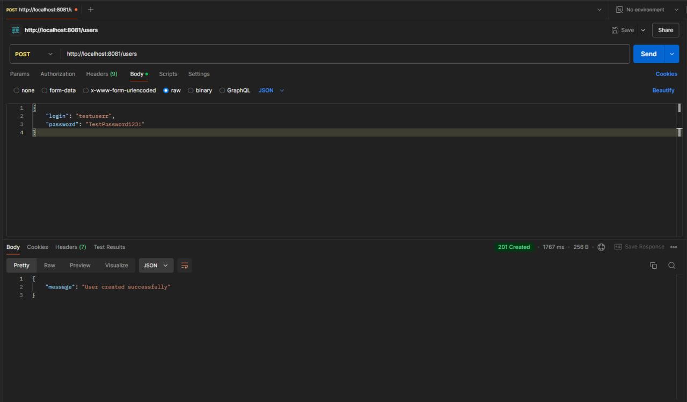
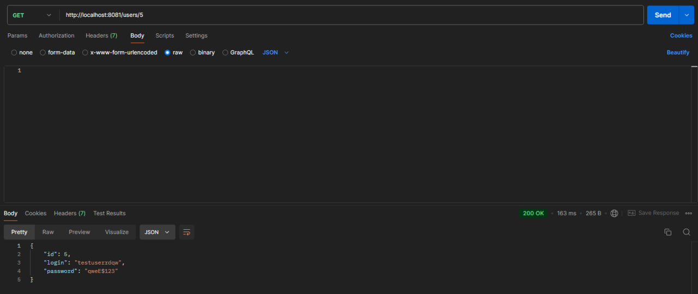
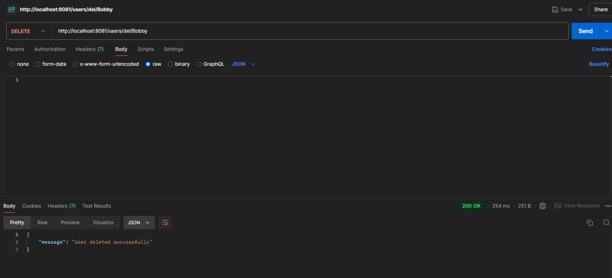
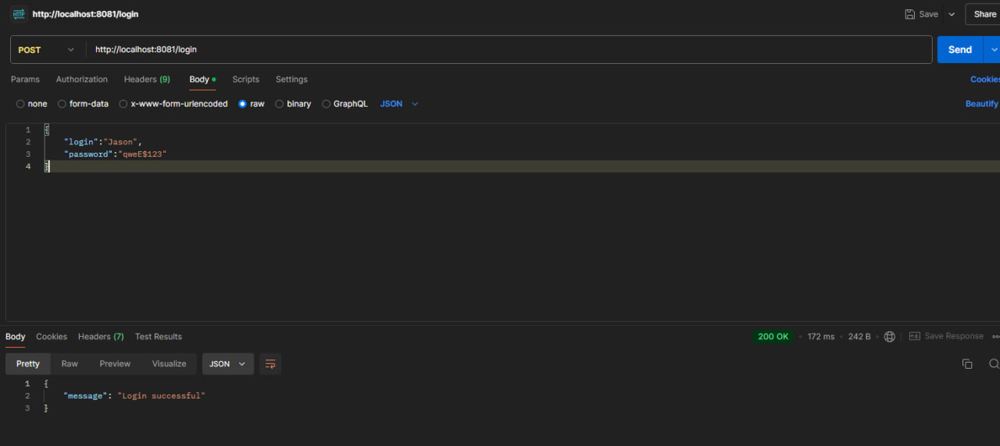

# Ton MP
### Запуск сервера
Запустите сервер командой:
```
php -S localhost:8081 -t public
```
# Структура
## Миграция таблицы
Для создания таблицы в базе данных создана миграция в файле *migrations/Version20240929122444.php*
Для её запуска примините команду:
```
php bin/console doctrine:migrations:migrate
```
В файле **Entity/User.php** представлена сущность User, при необходимости внесите изменения
<br>
Так же не забудьте поменять **DATABASE_URL** в файле .env на ваши актуальные данные

## API Методы
Методы реализованны в файле **Contriler/UserController**
### Создание пользователя
#### POST /users
Создает нового пользователя в базе данных
* Тело запроса: JSON с полями login и password
* Возвращает: JSON с сообщением об успешном создании пользователя, либо ошибкой



### Получение информации о пользователе
#### GET /users/{id} или GET /users/login/{login}
Возвращает информацию о пользователе по ID или логину.

* Параметры: id или login
* Возвращает: JSON с информацией о пользователе



### Удаление пользователя
#### DELETE /users/{id} или DELETE /users/del/{login}
Возвращает информацию о пользователе по ID или логину.

* Параметры: id или login
* Возвращает: JSON с сообщением об успешном удалении пользователя или ошибкой



### Вход в систему
#### POST /login
Авторизует пользователя.

* Тело запроса: JSON с полями login и password
* Возвращает: JSON с сообщением об успешном входе в систему


